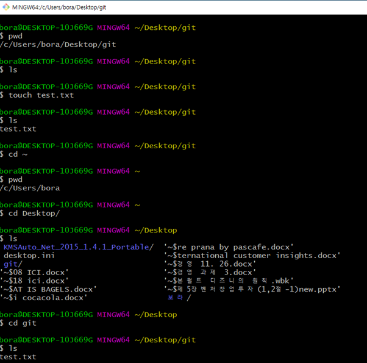
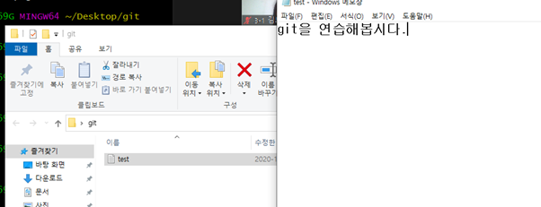
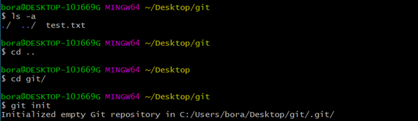
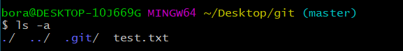
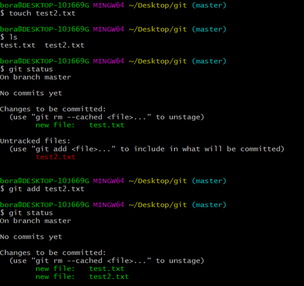
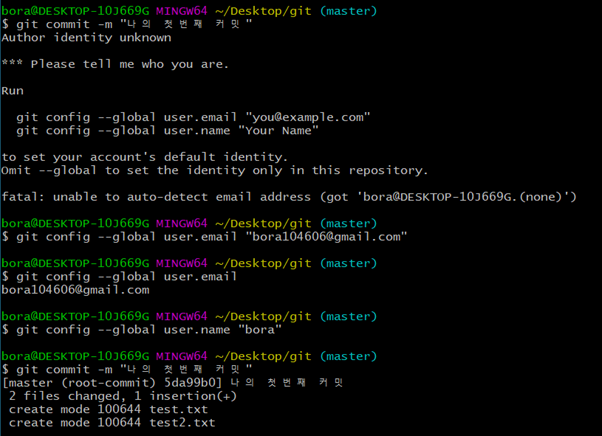
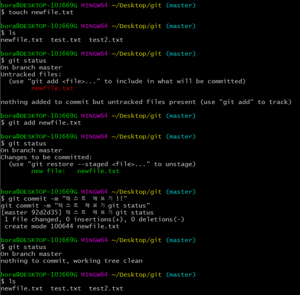
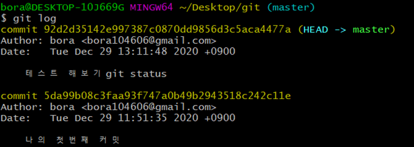

## 설치과정

- 브라우저에 `git for windows` 검색

- `download` 클릭

- 설치하기

- 바탕화면으로 가서 새폴더 `git` 만들기

- `git` 폴더로 들어가서 `우클릭 >> "Git Bash Here"`

  

- ``` 
  $ pwd
  $ ls
  $ touch test.txt
  $ ls
  $ cd ~
  $ pwd
  $ cd Desktop/
  $ ls
  $ cd git
  $ ls
  ```

- 

- 














- `ctrl + l` 누르면 화면 클리어 됨


## github repository 생성

- `github.com`에 로그인하기
- 우측 상단의 `+` 버튼 클릭하여 `New repository` 클릭

- `Repository name` 입력 하고 `Create repository` 버튼 클릭

  

  