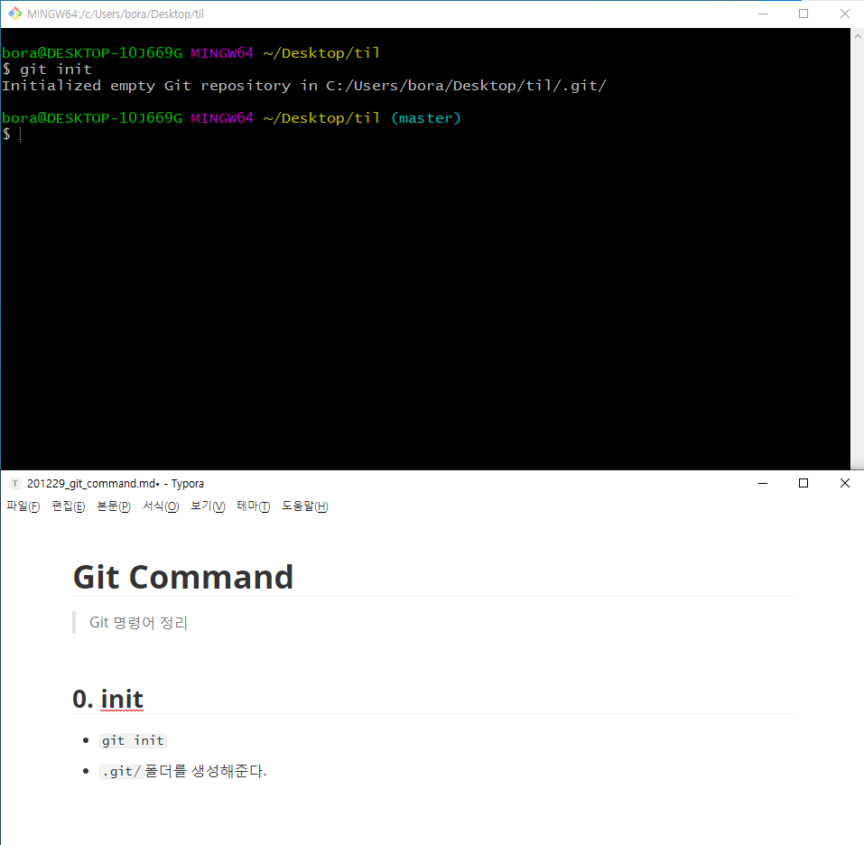

# Git Command

> Git 명령어 정리


## 0. init

- `````shell
  $ git init
  `````

- `.git/`폴더를 생성해준다.



- `.git` 폴더가 생성된 경우 오른쪽에 `master`라는 표시가 나온다.
- 최초에 한 번만 해주면 된다.


## 1. config

- `git config --global user.email "myemail@sample.com"`
  - 이메일의 경우 github에 올릴 경우 잔디가 심어지는 기준이므로 정확하게 입력해야 한다
- `git config --global user.name "myname"`
- 최초에 한 번만 하면 된다


# 커밋기록

## 1. add

- ````shell
  $ git add <추가하고 싶은 파일>
  ````
  
  - `git add . ` : 현재 폴더의 모든 파일과 폴더를 add
  
- working directory => staging area로 파일 이동


## 2. commit

- `````shell
  $ git commit -m "메세지"
  `````

- 스냅샷을 찍는 동작이며 메세지는 꼭 적어줘야 한다.

- add 되어 있는 파일들을 하나의 묶음으로 저장

- 메세지에 들어가는 내용은 기능 단위로 


## 3. remote

- ````shell
  $ git remote add origin <주소>
  ````

- 원격 저장소와 로컬 저장소를 연결하는 명령어


## 4. push

- ````shell
  $ git push origin master
  ````

- git아 올려줘 origin으로 master를

- 원격저장소에 로컬 저장소의 데이터를 전송


# 상태확인

## 1. status

- `git status`
- 현재 git 상태를 출력


## 2. log

- `git log`
- 커밋 기록을 전체 다 출력
- 옵션
  - `--oneline` : autho, date 같은 정보를 제외하고 한 줄로 출력
  - `--graph` : 커밋들을 점으로 표현하고 그 커밋을 선으로 연결해서 그래프 형태로 출력


## 3. diff

- `git diff`
- 현재 변경사항을 체크 (add 하기 전에)


# 추가 파일

## 1. gitignore

- `.gitignore` 파일을 생성 후 `git`으로 관리하고 싶지 않은 파일들을 저장
- `gitignore.io` 사이트를 사용하는 것이 더 좋음


# 브랜치

## 1. 생성

- ```shell
  $ git branch <브랜치 이름>
  ```


## 2. 이동

- ```shell
  $ git switch <브랜치 이름>               // 최신문법
  $ git checkout <브랜치 이름>				// 구버전 문법
  ```


## 3. 삭제

- ```shell
  $ git branch -d <브랜치 이름>
  ```


## 4. 병합

- ```shell
  $ git merge <브랜치 이름>
  ```

- base가 되는 branch로 이동해서 명령어 사용

- 충돌이 발생한 경우 -> 충돌을 해결하고 다시 add, commit, push