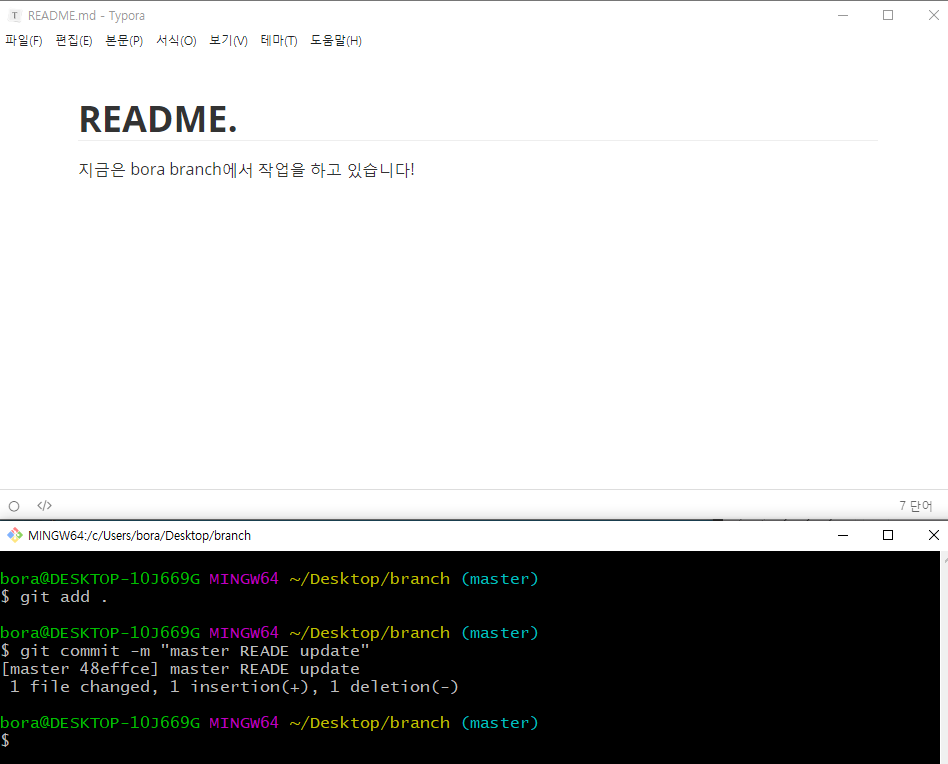
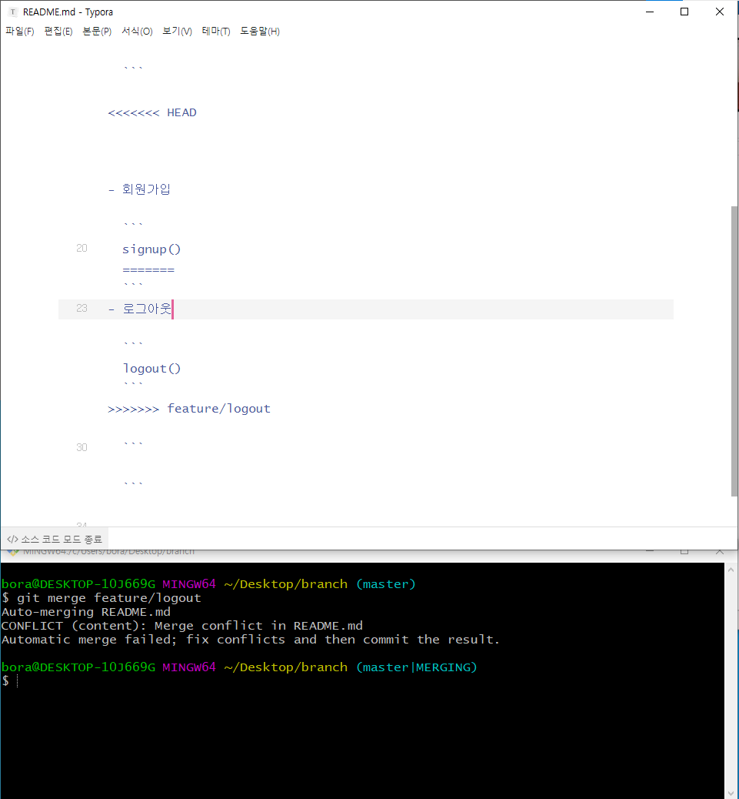

# Branch

- `github.com` > `Repository name` 명 작성 > `Create repository`


## bora라는 branch를 끌어오기

- ```shell
  $ git merge bora
  ```

  

- master와 bora branch가 동일 선상에 있다는 것을 볼 수 있다.

  ```shell
  $ git log --oneline --graph
  ```

  


## 다른 branch 삭제

- ```shell
  $ git branch -D bora
  $ git branch
  ```


## 다른 branch와의 충돌로 인한 merge





- 아래와 같이 나오면 충돌 일어난 것이 아니다. 왜?
  - feature/login -> 맨 아랫줄 수정
  - master -> 맨 윗줄 수정
    - 그러므로 `git merge <feature/login>`을 하면 된다.


- 저장하고 나가기


- 즉, 3 way merging이다

  

  


## branch 삭제

- branch 삭제

  ```shell
  $ git branch -D feature/login	
  ```

  

- branch 삭제 되었는지 확인

  ```shell
  $ git log --oneline --graph
  ```

  

  


## 같은 줄에서 수정하여 충돌을 만들기

- 로그아웃 branch 만들어서 수정하기





