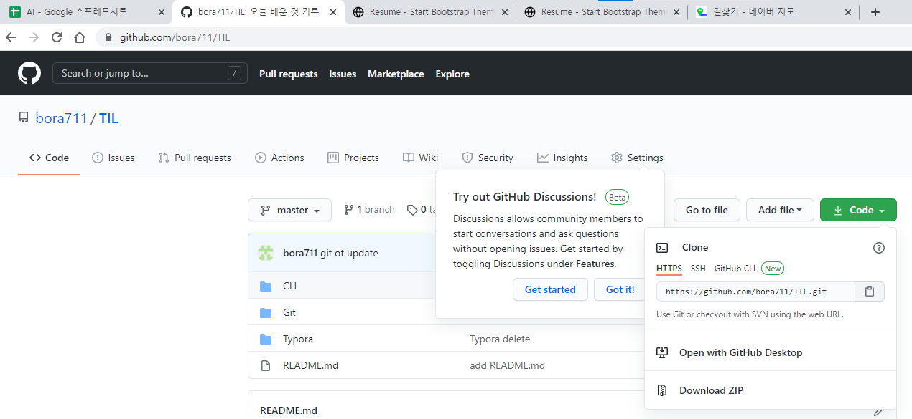

# Clone 하기

- `multicampus` 폴더 만들기


- `github.com` >`repository 선택` > `code` > `https clone`

  

- `multicampus 폴더` -> 우클릭 -> `Git Bash Here`

- ```shell
  $ git clone https://github.com/bora711/TIL.git
  $ ls
  ```

  

- `바탕화면\multicampus\TIL` 폴더 생성되었는지 확인

  


## 다른 컴퓨터에서 clone 할 때의 구조


## Clone 후 수정할때

- `바탕화면\multicampus\TIL\README` 파일 수정

  

  

  

  


- clone하여 remote 주소를 이미 알고 있기 때문에 push를 해도 `바탕화면\til`에도 업데이트가 된다.

  

  

- `github.com` > `repository` > `TIL` > `README.md` 확인


## 당겨오기 

- ```shell
  $ git pull origin master
  ```

  

- `바탕화면` -> `til` -> `README` -> 업데이트된 파일과 내용 확인

  


