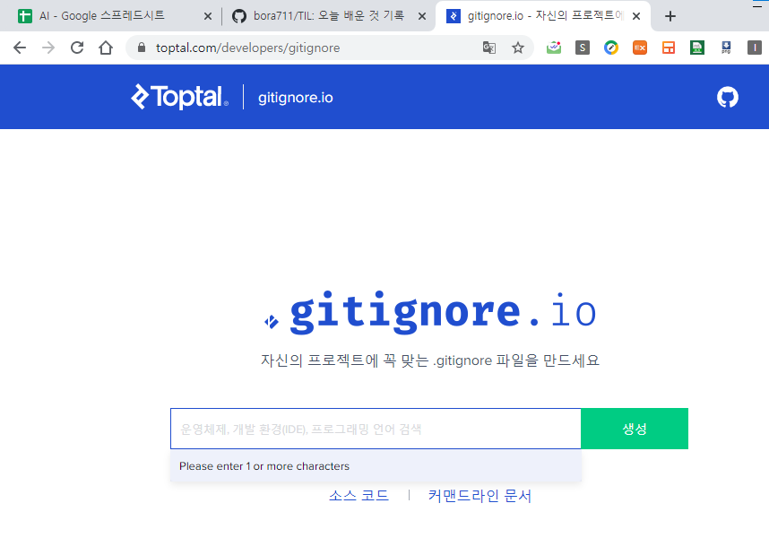
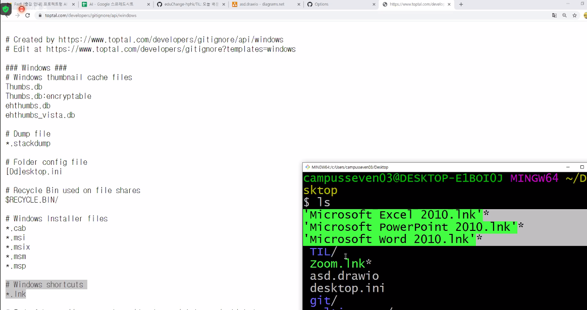
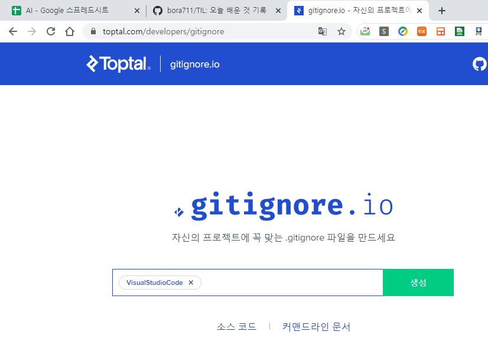
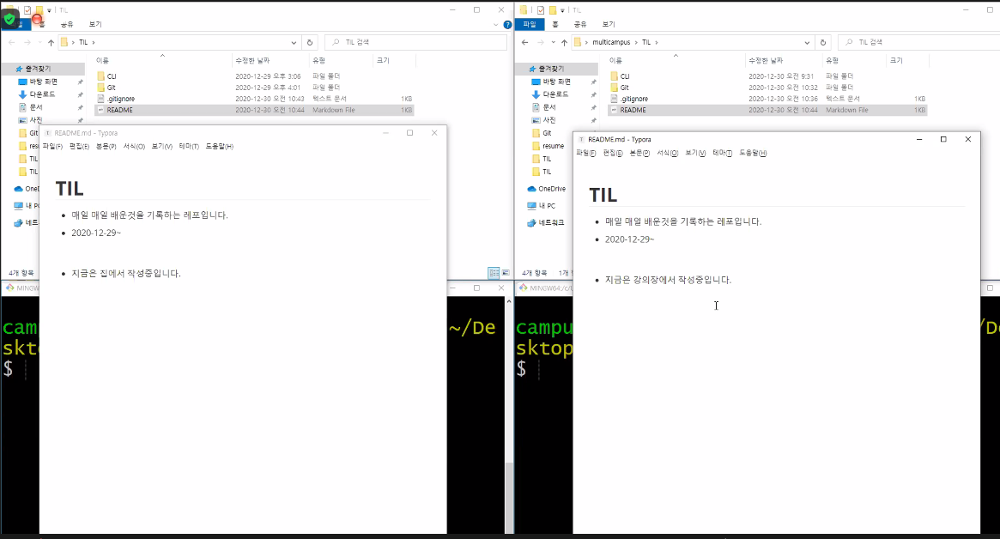
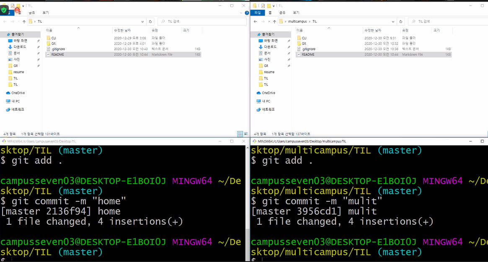
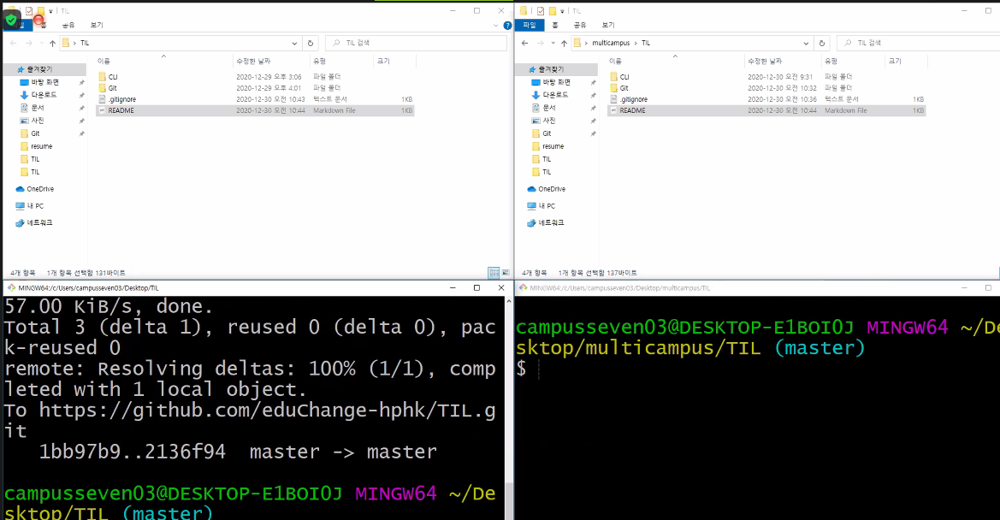
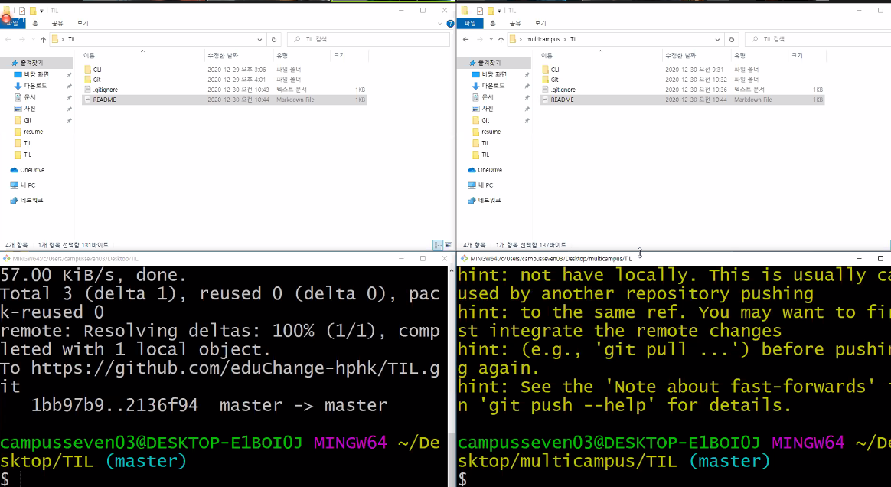
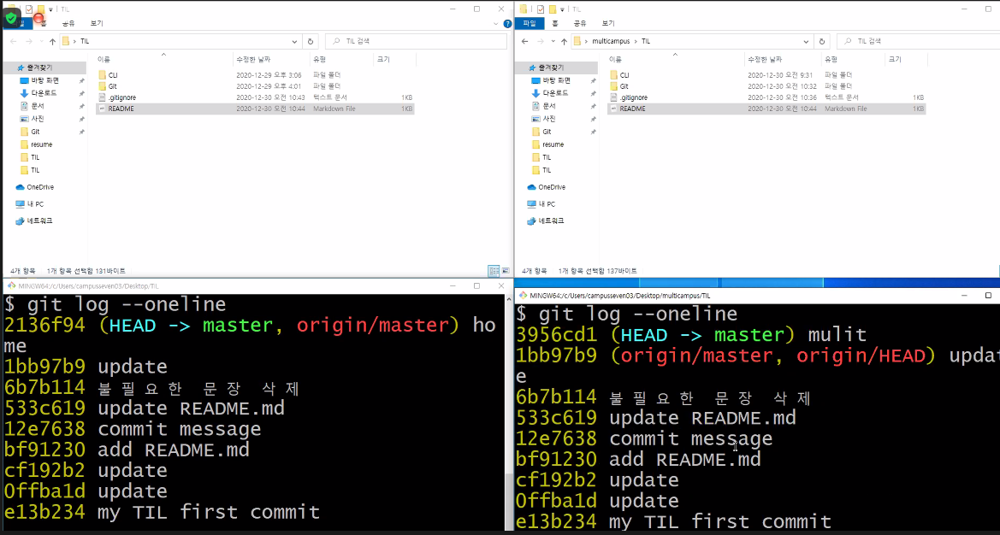
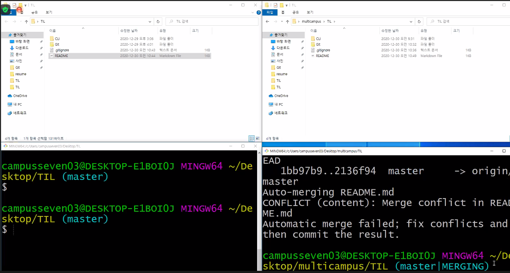

# 원하지 않은 파일 빼고 올리기









`.gitignore`는 최상단에 둬야 한다. 예를 들어 `db.sqlite`가 `.gitignore`랑 같이 있다면 `db.sqlite` 를 제외 시켜주지 않기 때문에 유저 정보 (아이디, 이름, 비밀번호 등)가 남아있다.


## 둘의 싱크가 안맞아서 생기는 오류





- 데이터를 올리는 과정에서 오류 남








- ```shell
  git pull origin master
  ```



