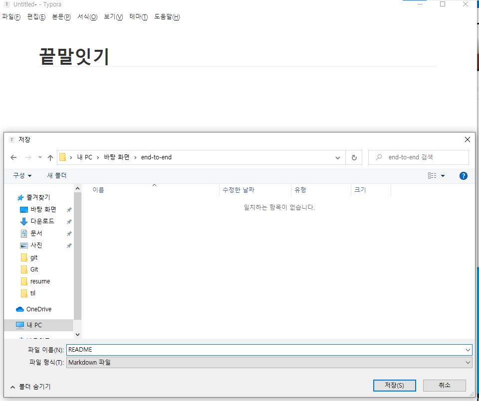
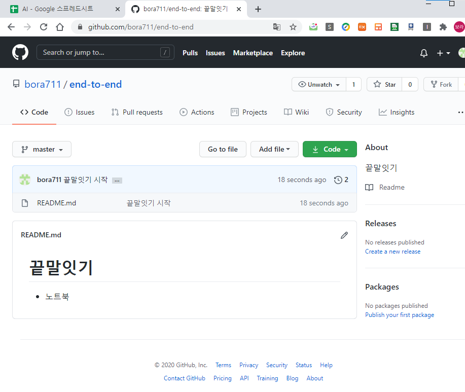

# 원하지 않은 파일 빼고 올리기


`.gitignore`는 최상단에 둬야 한다. 예를 들어 `db.sqlite`가 `.gitignore`랑 같이 있다면 `db.sqlite` 를 제외 시켜주지 않기 때문에 유저 정보 (아이디, 이름, 비밀번호 등)가 남아있다.


## 둘의 싱크가 안맞아서 생기는 오류


- 데이터를 올리는 과정에서 오류 남


- ```shell
  git pull origin master
  ```


- ```shell
  $ git add .
  $ git commit -m "머징완료"
  $ git push origin master
  ```

  

  


- ㅇ

  ```shell
  $ git log --oneline
  $ git pull origin master
  ```

  

  


## 이런 경우는 오류 안 남


## 끝말잇기








### git 클론 받기

- `바탕화면\Git Bash Here`


```
$ git pull origin master
```


