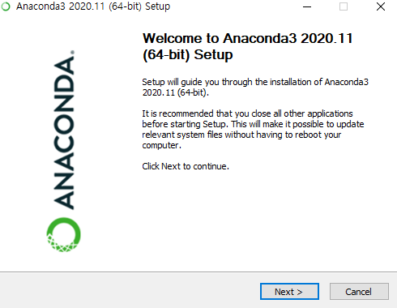
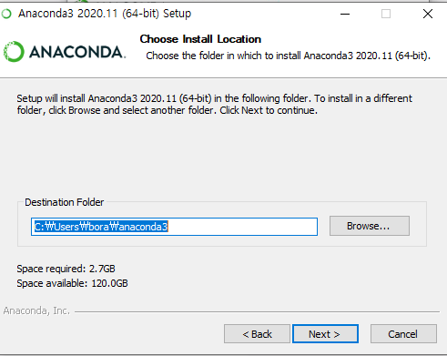
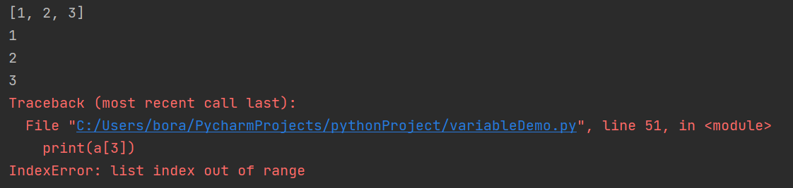
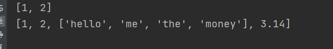
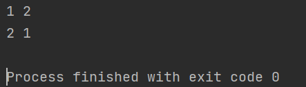
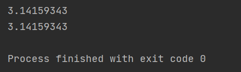

# 인터페이스 개발

> 임정섭 강사님
>
> jslim9413@naver.com


** 개발자들이 많이 쓰는 폰트는 D2 coding 폰트!! **


## 프롤로그

> source code >> compile (기계어) >> interpriter (runtime) >> java
>
> source code >> interpriter (runtime) >> python


1. 분석

   - R, SPSS

   

2. python

   - 분석, 토예 관련 lib, OOP

     - tools (anaconda, pycham) install

       

       

       

       

       

       

       

       

       

       

       

       

       

       

       

       

       

       

       

       

       

       

       

       

       

       

       

       - 모듈 방식의 코드 관리

       

       

       - 인터프리터 방식의 코드 관리

       

3. WEB

   - Django Frame


## 기본 개념

```python
# comment -- 주석

***
변수 - 데이터를 담는 공간 또는 그릇
함수 - 행위 (업무 로직 및 알고리즘)

클래스
- 변수
- 함수
- 생성자

python 장점
- 상대적으로 쉽다
- interaction programing
- 분석, 통계에 관련된 library 풍부하다
- Open Source (무료)
- R에 비해서 범용적

python 단점
- 하위호환성이 없다
***

# keyword module loading
import keyword                      // import는 keyword라는 모듈
print(keywork.kwlist)				// python은 대소문자 구분 가능함

# 변수의 생성 및 삭제
# 인터프리터 기반의 언어
# 변수선언 방법 : 1. Camel Case      2. Pascal Case		3. Snake Case
# 1. Camel Case : 함수정의서 많이 사용하는 방법 number0fCollageGraduates (권장)
# 2. Pascal Case : 클래스 정의 시 사용하는 방법 Number0fCollageGraduates
# 3. Snake Case : 권장하지 않는다 number_of_collage_graduates

a = 100
print(a)

del a
print(a)

# python data type (Built-in Types): 1. Numeric		2. Sequence		3. Text Sequence	4. Mapping 		5. Set		6. Bool
# 1. Numeric : 정수, 실수
# 2. Sequence : list, tuple, range (python은 array 없음. 그래서 list를 array로 씀)
# 3. Text Sequence : string
# 4. Mapping : dictionary
# 5. Set : set
# 6. Bool : 함수는 아니지만 True (T), False (F), not, and or (논리연산자), & | ~ (비교연산자)로 사용
# 7. date, timedate (날짜)
```


## Numeric 실습

```python
# Numeric (숫자, 정수, 실수)

a = 123
b = 3.14
c = 3.14E10     # 지수형

# e = 0o34        # 8진수
# f = 0xAB        # 16진수

# type()
print(type(a))
print(type(b))
print(type(c))

div = 3/4
print(div)

result = 3 ** 3
print(result)

result = 10 % 3
print(result)

result = 10 // 3
print(result)
```


```python
# Sequence - list
# 임의의 값을 순서대로 저장하는 집합 자료형 (index 부여 및 값 변경 가능한 형식)
# 함수를 이용하는 방법과 []를 이용하는 방법이 있다.
# rane() 이용하여 리스트를 생성하는 방법이 있다.	

print('''
임의의 값을 순서대로 저장하는 집합 자료형 (index 부여 및 값 변경 가능한 형식)
함수를 이용하는 방법과 []를 이용하는 방법이 있다.
rane() 이용하여 리스트를 생성하는 방법이 있다.	
''')

a = []
print (type(a))

a = list()
print (type(a))
```


```python
a = [1, 2, 3]
print(a)

# indexing
print(a[0])
print(a[1])
print(a[2])
print(a[3]) 	# error
```




```python
print(a[-1])
```


```python
# slicing
print('slicing')
print(a[0:2]) 	# a[0] ~ a[i-1] 출력
```


```python
a = [1, 2, 'hello', 3.14]
a = [1, 2, ['hello', 'me', 'the', 'money'], 3.14]
print(a)
```




```python
a = [1, 2, 'hello', 3.14]
a = [1, 2, ['hello', 'me', 'the', 'money'], 3.14]
print (type(a[2]))
print(a[2][2:]) 		# a[2]의 a[2,2] ~ a[2,3] 출력
```


```python
a = [1, 2, 3]
b = [4, 5, 6]

print (a + b)
print (a * 3)
```


```python
print (a)
a[0] = 5
print(a)
```


## 변수 선언법

```python
# 허용하는 변수 선언법
# 예약된 변수명으로 사용 불가
_age = 49
"""
False	def	if	raise
None	del	import	return
True	elif	in	try
and	else	is	while
as	except	lambda	with
assert	finally	nonlocal	yield
break	for	not	
class	from	or	
continue	global	pass	
"""

year = 2021
month = 1
day = 4

print (year, month, day)


str = "python start!!"
print(type(str))

str = "bora's python lecture"
print(type(str))

#separator 옵션
print('p', 'y', 't', 'h', 'o', 'n')
print('p', 'y', 't', 'h', 'o', 'n', sep="")
print('010', '4603', '2283', sep="-")
print('python', 'google.com', sep='@')

"""
참고 : Escape 코드
\n : 개행
\
\\ : 문자
\' : 문자
\" : 문자
\000 : 널 문자
...
"""
```


```python
# end 옵션
print("Welcome To", end=' ')
print("IT News", end=' ')
print('Web Sites')
```


```python
# format 사용법 (d, s, f)
one = 1
two = 2
print('%d %d' %(one, two))
```


```python
# format 사용법 (d, s, f)
one = 1
two = 2
print('%s %s' %(one, two))
print('{} {}'.format(one, two))
```


```python
# format 사용법 (d, s, f)
one = 1
two = 2
print('%s %s' %(one, two))
print('{1} {0}'.format(one, two))
```




```python
# format 사용법 (d, s, f)
one = 1
two = 2
print('%s %s' %(one, two))
print('{1} {0}'.format(one, two))

print('%10s' % ('nice', ))
print('%-10s' % ('nice', ))
```


```python
print('%1.8f' % (3.141593434935800348))
print('{:1.8f}'.format(3.14159343493580348))
```




## Tuple

> Tuple이란 개념은 매우 중요하다. packing, unpacking 할 때 필요하기 때문이다.


```python
# tuple
# ()

a = ()
print(type(a))
```


```python
# tuple
a = (1)
print(type(a))
```


```python
# tuple
a = (1, )
print(type(a))
```


```python
# tuple
a = (1, 2, 3)
print(type(a))
```


```python
# tuple과 list의 차이
a = ()
print(type(a))

a = list(a)
print(type(a))
```

