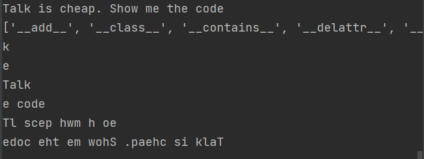

# 변수 정의 및 생성

> https://docs.python.org/3/library/index.html 참고


## 스칼라 데이터 타입

```python
intValue = 123
floatValue = 3.14
boolValue = True
strValue = 'borakim'
```

#### 블럭단위 실행 단축키

> shift + alt + e

```python
intValue = 123
floatValue = 3.14
boolValue = True
strValue = 'borakim'

print()
print(type(intValue), type(floatValue), type(boolValue), type (strValue))
```


## type casting

```python
# type casting
numStr = "720"                  # 문자열 정수
numNum = 100
print(numStr + numNum)
```


```python
# type casting
numStr = "720"
numNum = 100
print(int(numStr) + numNum)
```


```python
# type casting
numStr = "bora"
numNum = 100
print(int(numStr) + numNum)
```


```python
# type casting
numStr = "720"
numNum = 100
print(numStr + str(numNum))
```


```python
year = "2021"
print(int(year) - 1)
```


```python
# Dict
dictValue = {
    "name"  : "machine Learning",
    'version' : 2.0
}
print(type(dictValue))
```


```python
# tuple()
tupleValue = (3,)
print(type(tupleValue))
```


```python
# keyboard input
# function syntax
'''
접근지정자 리턴타입 함수명(매개변수) {

}
python function
def sum() :
	statement
'''

#input()
inputNumber = input('숫자를 입력하세요 : ')
print(inputNumber)
```


```python
#input()
inputNumber = int(input('숫자를 입력하세요 : '))
sum = 100 + inputNumber
print(sum)
```


## 문자형

```python
# 문자형 (str)
str01 = 'I am Python'
str02 = "Python"
str03 = """this is a 
multiline
sample text"""
```


```python
seqText = 'Talk is cheap. Show me the code'
print(seqText)
```


```python
seqText = 'Talk is cheap. Show me the code'
print(seqText)

# dir()
print(dir(seqText))

# indexing()
print(seqText[3])
print(seqText[-1])

# slicing()
print(seqText[0:4])
print(seqText[-6: ])		# 문장의 마지막 음절-6 ~ 문장의 마지막 음절
print(seqText[ : :2])		# seqText[0] ~ seqText[i+2] 반복
print(seqText[ : :-1])		# Reverse
```




```python
# 아래의 문자열에서 '홀'만 출력하세요~
string = '홀짝홀짝홀짝홀짝홀짝'
print(string[::2])
print(string[::-1])
```


```python
# 문자열 조작을 위한 많은 내장 함수를 제공하고 있다
string = "python"
print("Capitalize : ", string.capitalize())
```


## 문자치환

```python
# 문자치환 replace (oldchar, newchar)
phoneNumber = '010-4603-2283'
replacePhoneNumber = phoneNumber.replace('-', " ")
print(replacePhoneNumber)

string = 'abcdfaw239382hdkfjal1'
print(string.replace('a', 'A'))
```


## Split() 

> 문자열을 쪼개는 함수

```python
# 문자열을 쪼개는 함수 : split('.')
# 아래 문자열에서 도메인만 출력하고 싶다면?
url = "http://www.naver.com"
urlSplit = url.split('.')
print(urlSplit, type(urlSplit))
print('domain : ', urlSplit[-1])
```


##  공백 제거 함수, 문자길이 함수

```python
# 문자열에서 공백 제거 함수 : strip(), rstrip(), lstrip()
companyName = '          samsung     '
print(companyName.strip(), len(companyName.strip()))
print(companyName.rstrip(), len(companyName.rstrip()))
print(companyName.lstrip(),len(companyName.lstrip()))
print(companyName.upper())
```


## endswitch() 문자열 조작 함수

```python
# endswitch()
fileName = 'report.xls'
isExits = fileName.endswith(('xls', 'xlsx', 'csv'))
print(isExits, type(isExits))
```


```python
# in, not in -> True | false
myStr = "This is a sample Text"
print("Sample" in myStr)
print("text" not in myStr)
print("this" in myStr.lower())
```


```python
# 문자의 빈도 count(), 문자 찾기 find(), 문자의 인덱스 index()
brandName = 'cocacola'
print(len(brandName), brandName.count('c'), brandName.find('f'), brandName.find('a'), brandName.index('a'))
```


## list

> list는 python sequence type이다.
>
> 자료구조에서 중요함
>
> 파이썬에는 배열 존재하지 않는다
>
> 1차원 자료구조 : R - Vector
>
> 순서 존재한다 (index 부여 가능함), 중복 가능하다, 수정/삭제 가능하다 
>
> []를 이용해서 변수를 선언할 수 있다

a = list()             # list끼리 연산도 가능

a = []


```python
a= [1, 2, 3]
print(a, type(a))
print(a[0])
a[0] = 5
print(a[0])
```


## 요소 추가하는 함수

> append(), insert()

```python
a.append(4)
print(a)
a.insert(0, 6)
print(a)
a.sort()
print(a)
a.reverse()
print(a)
```


## 기존 리스트에서 요소를 가져오고 삭제

> pop()

- 중간의 요소일 경우 삭제는 불가능하다
- 리스트의 맨 끝에서부터 하나씩 삭제할 수 있다

```python
print("a - pop() : ", a.pop())
print("a - print : ", a)
```


## extend() vs append()

> extend(), append()

```python
ex = [4, 3]
a.extend(ex)
print('a - extend : ', a)

ex2 = [4, 3]
a.append(ex2)
print('a - append : ', a)
```


```python
movieRank = ['원더우먼', '해리포터', '겨울왕국2', '가타카', '국제수사', '반도']
# 1. 해당리스트에 '배트맨'을 추가한다면?
movieRank.append('배트맨')
print('append - 배트맨', movieRank)

# 2. 원더우먼과 해리포터 사이에 '씽'을 추가한다면?
movieRank.insert(1, '씽')
print('insert - 씽', movieRank)

# 3. 리스트에서 반도를 삭제한다면?
movieRank.remove('반도')
print('remove - 반도', movieRank)

idx = movieRank.index('국제수사')
print('a 국제수사 idex : ', idx)
print('a pop() : ', movieRank.pop(idx))
print('pop index 5 : ', movieRank)
```


## 최댓값, 최솟값, 총합, 평균

```python
scoreData = [1, 2, 3, 4, 5, 6, 7]
print("max", max(scoreData))
print("min", min(scoreData))
print("sum", sum(scoreData))
print("mean", sum(scoreData) / len(scoreData))
```


## Dictionary

```python
dict01 = {
    'name' : "bora",
    'age'  : 30,
    'address': 'incheon',
    'birth' : '0507',
    'gender' : 'f'  
}
print('dict', type(dict01), dict01)

# dict 요소를 추가하는 방법
dict01['marriage'] = True  
print('dict - ', type(dict01), dict01)

# 키 유무를 판단
print('marriage' in dict01)

# 데이터 확인
print('address - ', dict01['address'])
```


```python
dict03 = {
    'name': "bora",
    'age': 30,
    'address': 'incheon',
    'birth': '0507',
    'gender': 'f'
}
print('dict03 - ', type(dict03), dict03)

# dict_keys, dict_values, dict items
print('dict_keys - ', dict03.keys(), type(dict03.keys()), type(list(dict03.keys())))
print('dict_values - ', dict03.values(), type(dict03.values()), type(list(dict03.values())))
print('dict_items - ', dict03.items(), type(dict03.items()), type(list(dict03.items())))
```


## looping

> ```python
> '''
> for (초기식; 조건식; 증감식) {
> 
> }
> for item in collection:
>     statement
> '''
> ```

```python
for key in dict03.keys() :
    print('key : {}, value : {}'.format(key, dict03.get(key)))
```


```python
for key in dict03.keys() :
    print('key : {}, value : {}'.format(key, dict03[key]))

for value in dict03.values() :              # dict03.values()는 반복을 의미
    print('value : {}'.format(value))
    
for (key, value) in dict03.items() : 
    print('key : {}, value : {}'.format(key, value))
```


```python
# 삭제 pop(), del
print('dict03 - ', type(dict03), dict03)
del dict03['gender']
print('dict03 del - ', type(dict03), dict03)
print('dict03 pop - ', dict03.pop('birth'))
print('dict03 del - ', dict03)

dict03.clear()
print('dict03 clear - ', dict03)
```


