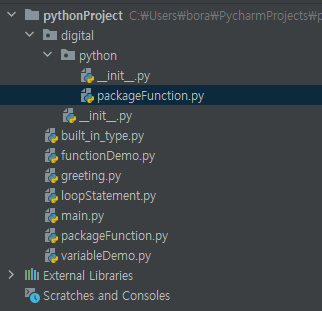
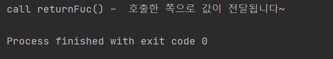
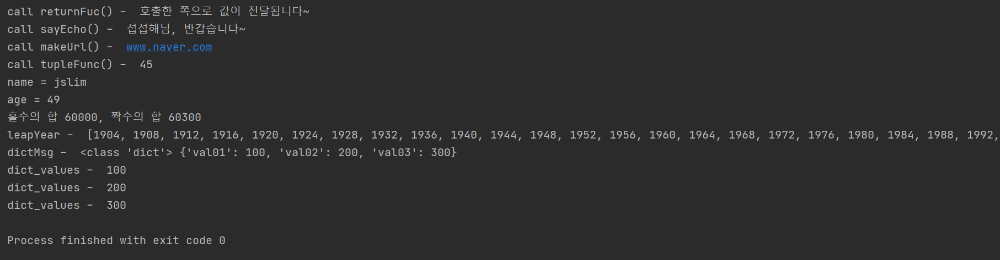

# 모듈 호출1 

> pythonProject >> 우클릭 >> 
>
> 

## functionDemo

```python
# python function
'''
함수는 가독성을 높이기 위한 방법으로
하나 이상의 본문을 가지는 코드는 함수로 정의하는 것이 좋다
내장함수 | 사용자 정의 함수
함수를 정의할 때는 def 키워드를 이용해서 함수를 정의
'''
# user define function
'''
def functionName() : 
    statement
    return values(built-in Type)
'''

# from digital.python import packageFunction (이게 기본개념!을 토대로 확장해야 함)
# packageFunction.printCoins()

# from digital.python import packageFunction as f
# f.printCoins()

# from digital.python.packageFunction import printConins
# printCoins

from digital.python import packageFunction as f
rtnMsg = f.returnFunc()
print('call returnFuc() - ', rtnMsg)
```


## packageFuntion

```python
# 매개변수 X, 리턴값이 X
def printCoins() :
    print('bitcoin')

# 매개변수 X, 리턴값이 O
def returnFunc() :
    return'호출한 쪽으로 값이 전달됩니다~'
```




# 모듈 호출2


## functionDemo

```python
# python function
'''
함수는 가독성을 높이기 위한 방법으로
하나 이상의 본문을 가지는 코드는 함수로 정의하는 것이 좋다
내장함수 | 사용자 정의 함수
함수를 정의할 때는 def 키워드를 이용해서 함수를 정의
'''
# user define function
'''
def functionName() : 
    statement
    return values(built-in Type)
'''

# from digital.python import packageFunction (이게 기본개념!을 토대로 확장해야 함)
# packageFunction.printCoins()

# from digital.python import packageFunction as f
# f.printCoins()

# from digital.python.packageFunction import printConins
# printCoins

from digital.python import packageFunction as f
rtnMsg = f.returnFunc()
print('call returnFuc() - ', rtnMsg)

echoMsg = f.sayEcho('섭섭해')
print('call sayEcho() - ', echoMsg)

domain = f.makeUrl('naver')
print('call makeUrl() - ', domain)

f.badFunc('jslim')

tuRtn = f.tupleFunc(1,2,3,4,5,6,7,8,9)
print('call tupleFunc() - ', tuRtn)

f.dictFunc(name = 'jslim', age = 49)

(oddSum, evenSum) = f.cntSum(100, 500)
print('홀수의 합 {}, 짝수의 합 {}'.format(oddSum, evenSum))

# 인자로 넘겨받은 년도 사이의 윤년을 찾아 리턴시켜주는 함수를 작성한다면?
# list 타입
leapYearList = f.leapYearFunc(1900, 2021)
print('leapYear - ', leapYearList)

dictMsg = f.rtnDictFunc(10)
print('dictMsg - ', type(dictMsg), dictMsg)

for value in dictMsg.values() :
    print('dict_values - ', value)
```


## packageFunction

```python
# 매개변수 X, 리턴값이 X
def printCoins() :
    print('bitcoin')

# 매개변수 X, 리턴값이 O
def returnFunc() :
    return'호출한 쪽으로 값이 전달됩니다~'

# 매개변수 O, 리턴값이 O
def sayEcho(name) :
    return name+'님, 반갑습니다~'

# 매개변수 여러개 O
def calculator(op01, operator, op02) :
    pass

def makeUrl(url) :
    return "www."+url+".com"

# 매개변수 O, 리턴값이 X
def badFunc(name) :
    pass

def tupleFunc(*args) :
    result = 0
    for idx in range(len(args)) :
        result += args[idx]
    return result

def dictFunc(**args) :
    for key, value in args.items() :
        print('{} = {}'.format(key, value))


# 범위 내에 있는 값의 홀, 짝의 합을 구해서 리턴
def cntSum(start, end)  :
    odd = even = 0
    for x in range (start, end+1) :
        if x % 2 == 0 :
            even += x
        else :
            odd += x

    return (odd, even)      # tuple 형식으로 값을 전달

def leapYearFunc(strYear, endYear) :
    yearList = []
    for year in range(strYear, endYear+1) :
        if (year%4 ==0 and year%100 !=0) or (year%400 == 0) :
            yearList.append(year)
    return yearList

def rtnDictFunc(x) :
    y01 = x * 10
    y02 = x * 20
    y03 = x * 30
    return {'val01' : y01, 'val02': y02, 'val03' : y03}
```




