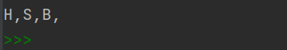

# comprehension

> for 구문을 통한 반복적인 표현식을 이용할 수 있다 if


## for

```python
userList = [1, 2, 3, 4, 5, 6, 7, 8, 9]
userList02 = [tmp ** 2 for tmp in userList]
print('comprehension - ', userList02)

userList03 = [tmp ** 2 for tmp in userList if tmp%2 == ]
print('comprehension if - ', userList03)
```


## dict에서도 사용 가능

```python
userDict = {'TEST' + str(tmp) : tmp ** 2 for tmp in range}
print(userDict)
```


## 단어의 빈도수 구하기

```python
wordVec = ["love", "word", "cat", "love", "love", "word"]
print(len(wordVec))

wordCnt = {}
for word in wordVec :
    wordCnt[word] = wordCnt.get(word, 0) + 1
	# get() : 해당 key의 value 값 가져오는 함수
print(wordCnt)
```


```python
wordVec = ["love", "word", "cat", "love", "love", "word"]

wordCnt02 = {}
for word in wordVec :
    if word in wordCnt02 :
        wordCnt02[word] += 1
    else :
        wordCnt02[word] = 1
```


## [], (), {}, {key:value}

```python
# 1 ~ 1000 합
rangeSum = 0
for value in range(1, 100) :
    rangeSum += value
print('1 ~ 1000 합 {} 입니다'. format(rangeSum))
```


```python
# 2000 ~ 2050년까지 올림픽이 개최되는 년도를 출력하라..
# 단, 한 줄에 5개의 년도를 출력하고 개행
cnt = 0
for year in range(2000, 2051, 4) :
    cnt += 1
    print(year, end = '\t')
    if cnt % 5 == 0 :
        print()
```


```python
# 아래 리스트에서 세 글자 이상의 단어만 출력하라..
wordList = {'I', 'am', 'study', 'python', 'language', '!'}
for word in wordList :
    if len(word) >= 3 :
        print(word)
```


```python
# 대문자만 출력하라
wordList = {'I', 'am', 'study', 'PYTHON', 'language', 'IF', 'for'}
for word in wordList :
    if word.isupper() :         # is로 시작하는 함수는 boolean 함수인 경우가 많다. isupper() 함수는 대문자
        print(word)
```


```python
wordList = ['dog', 'cat', 'pig', 'carrot', 'horse']
for word in wordList :
    print(word.capitalize())
```


```python
# 해당 파일의 확장자를 제거하고 파일 이름만 출력한다면?
# hint - split('.')
fileList = ['greeting.py', 'bool.py', 'intro.hwp', 'bigdata.doc', 'ai.doc']
for file in fileList :
    print(file, file.split('.'), file.split('.')[0])
```


```python
# 대문자만 추출하고 ',' 넣기
word = 'HandSome Boy'
for w in word :
    if w.isupper() :
        print(w, end = ',')
```




```python
# 주어진 문장에서 모든 문자를 대문자로 출력한다면?
dumySen = 'FasewiejlfSDJFweilcvijsWEfksjdifjlwDLfsjielfwjieskdDSDF'
for w in dumySen :
    if w.isupper() :
        print(w, end="")
    else :
        print(w.upper(), end="")E
```


```python
wordList = ['가', '나', '다', '라']
for word in wordList[::-1] :
    print(word)
```


## break, continue

```python
# break
search = 17
numbers = [14, 3, 4, 7, 10, 24, 17, 2, 33, 15, 34,36, 38]
for num in numbers :
    if num == search :
        print('Found - ', num)
        break 					# 17이면 for문 종료
    else :
        print('Not Found - ', num)
```


```python
# break2
search = 5								# numbers[]에 5는 없음
numbers = [14, 3, 4, 7, 10, 24, 17, 2, 33, 15, 34,36, 38]
for num in numbers :
    if num == search :			# 5가 있을 때 수행
        print('Found - ', search)
        break

    else :						# 5가 없을 떄 수행
        print('Not Found - ', search)	
        break							
```


```python
# continue
search = 17
numbers = [14, 3, 4, 7, 10, 24, 17, 2, 33, 15, 34,36, 38]
for num in numbers :
    if num == search :
        continue				# 17만 빼고 for문 실행
        print('Found - ', num)
        # break
    else :
        print('Not Found - ', num)
```


## for문 이해하기

```python
for i in range(1, 6) :
    for j in range(1, 4) :
        print('i - {}, j - {}'.format(i, j))
```


```python
# 구구단 2 ~ 9단
for i in range(2, 10) :
    for j in range(1, 10) :
        print('{} * {} = {}'.format(i, j, (i*j)), end = '\t')
    print()
```


```python
# 구구단 2 ~ 9단을 5단까지만 break
for i in range(2, 10) :
    for j in range(1, 10) :
        print('{} * {} = {}'.format(i, j, (i*j)), end = '\t')
    print()
    if i == 5 :
        break
```


## string에서 sentences, words

```python
string = \
'''
저는 여러분과 함께 파이썬 강의 중에 있는 섭섭해님 입니다 ^*^
어려운 시기에 함께하게 되어서 반갑습니다.
나이는 숫자에 불과하지만 성인병이 있네요~
'''
sentences = []
words = []

# append(), insert(), extend()
for s in string.split('\n') :
    sentences.append(s)
    for w in s.split() :
        words.append(w)
print('sentences - ', sentences, len(sentences))
print('words - ', words, len(words))
```


## 분류정확도

```python
# 분류정확도
answer = [1, 0, 2, 1, 0]
predict = [1, 0, 2, 0, 0]
acc = 0
for idx in range(len(answer)) :
    fit = answer[idx] == predict[idx]
    # print(int(ift), end='\t')
    acc += int(fit) * 20

print('classification accuracy -', acc)
```


```python
# enumerate
'''
enumerate
반복문 사용시 몇 번째 반복문인지 확인이 필요하다면
인덱스 번호와 컬렉션 요소를 확인할 수 있다
'''
booklist = ['SQL', 'R', 'TEXT-MINING', 'NLP', 'DATA-MINING', 'PYTHON', 'DJANGO']
for idx, book in enumerate(booklist) :
    print('index - {}, value = {}'.format(idx, book))
```


```python
# syntax
whileList = ['foo', 'bar', 'baz']
while whileList :     	# WhileList는 비어있지 않은 list 이므로 True이다
    print(whileList.pop())
    print('whileList - ', whileList)
print('while - end')
```


## random()

```python
# random() 알아가기
# 디버깅할 때마다 값이 달라짐
import random
ran = random.random()           # 0 ~ 1 사이의 난수를 발생시키는데 (실수형)
print('random - ', ran)

ran  = random.randint(0, 2)         # 정수형
print('random - ', ran)
```


```python
# 난수를 발생시켜서 횟수내에 맞추는 게임
'''
숫자 범위 : 1 ~ 10
내가 입력한 숫자 > 난수 : 더 작은 수를 입력
내가 입력한 숫자 < 난수 : 더 큰 수를 입력
'''
randNum = random.randint(1, 10)
while True :
    guessNum = int(input('예상 숫자를 입력하세요 : '))
    if randNum == guessNum :
        print('success')
        break
    elif randNum > guessNum :
        print('더 큰 수를 입력')
    else :
        print('더 작은 수를 입력')
```


```python
from random import randint

randNum = randint(1, 100)
tries = 1
while tries <= 20 :
    guessNum = int(input('예상 숫자를 입력하세요 : '))
    if randNum == guessNum :
        break
    elif randNum > guessNum :
        print('더 큰 수를 입력')
    else :
        print('더 작은 수를 입력')
    tries += 1
if guessNum == randNum :
    print('정답 시도횟수 {}'.format(tries))
    print('정답 {}'.format(randNum))
else :
    print('정답 {}'.format(randNum))
```


```python
# random choices()
dataset = list(range(1, 10001))
print(dataset)
```


```python
# 모집단 dataset에서 k개의 데이터를 샘플링하고 싶다면?
train = random.choices(dataset, k = 10)
print('sample dataset - ', train)
```

