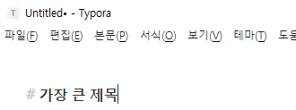
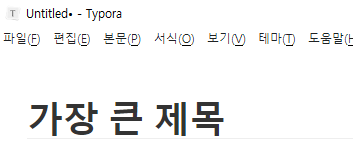
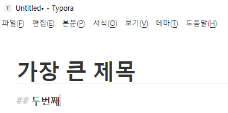
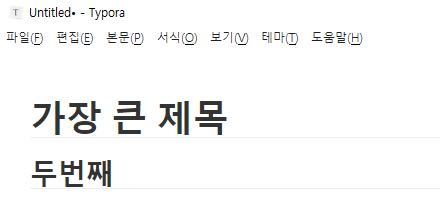
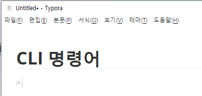
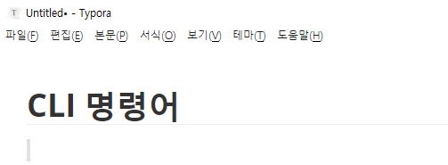
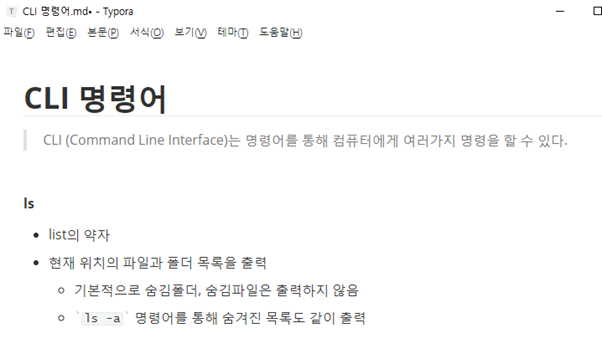
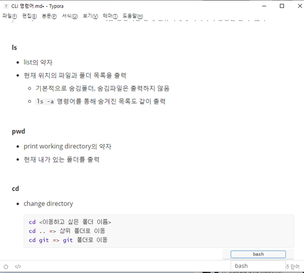

# 단축키


## "#" : 첫 번째 큰 제목




​																					-> 엔터





## "##" : 두 번째 큰 제목




​																				-> 엔터





## ">" : 인용문구 작성



​																						-> 엔터





## "ctrl + /" : 단축키로 쓴 서식을 나타냄


## "-" : list를 작성할 수 있는 목록 기호




## "```" : 코드를 적을 수 있는 박스 생성



